# Final Master's Work at VIU.

  
Main branch intro.

 This is a Computer Vision classification for Real State. The intention of this project is to improve the classification of different spaces inside houses. 

Consisting of:
- Fine-tuning of pre-trained models.
- Data augmentation.
    - TensorFlow method *ImageDataGenerator* in pickled data.
    - Adding data augmentation as a sequential layer using the TensorFlow method *image_dataset_from_directory*  straight from the pics folder.
- Study the creation of synthetic data.

----------------------------------

## Synthetic_data_study branch:

The test set, 150pics randomly chosen of each class, are separated from data. With the rest of the dataset:

**Regular folders.**

- If it is splitted in 5 different folders of same volume, shuffled every time, and divided into 20% for validation set and 80% for train set (just like a k-folds validation, but physically done), I get something like:

  
Output.

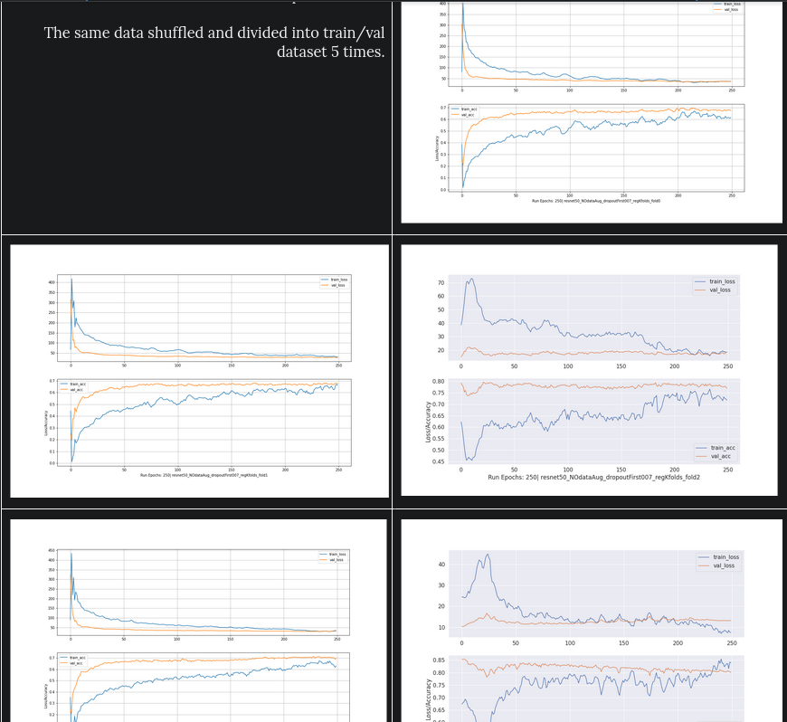

---------------------------------------------------

**Irregular folders.**

To personally check performance vs lack of data, another setup was tested: The train set decreases each time (first picture is the 80% of available. Others are the 80%, 62%, 46%, 30%, 20%, 10% of the initial 80%). Validation set is always a shuffled-every-time 20%.

  
Volume I am working with:.

    
- 80% of available data for train set. 

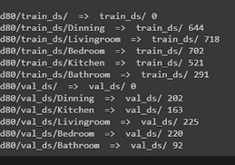

- 62% 

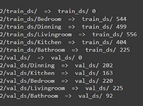

- 46% 

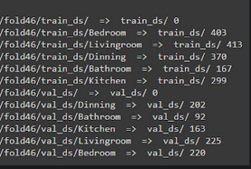

- 30% 

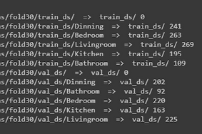

- 20% 

- 10% (yeah, it's shitty and non sensical, don't panic yet)

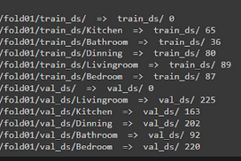

  
Performance: Train and validation accuracy.

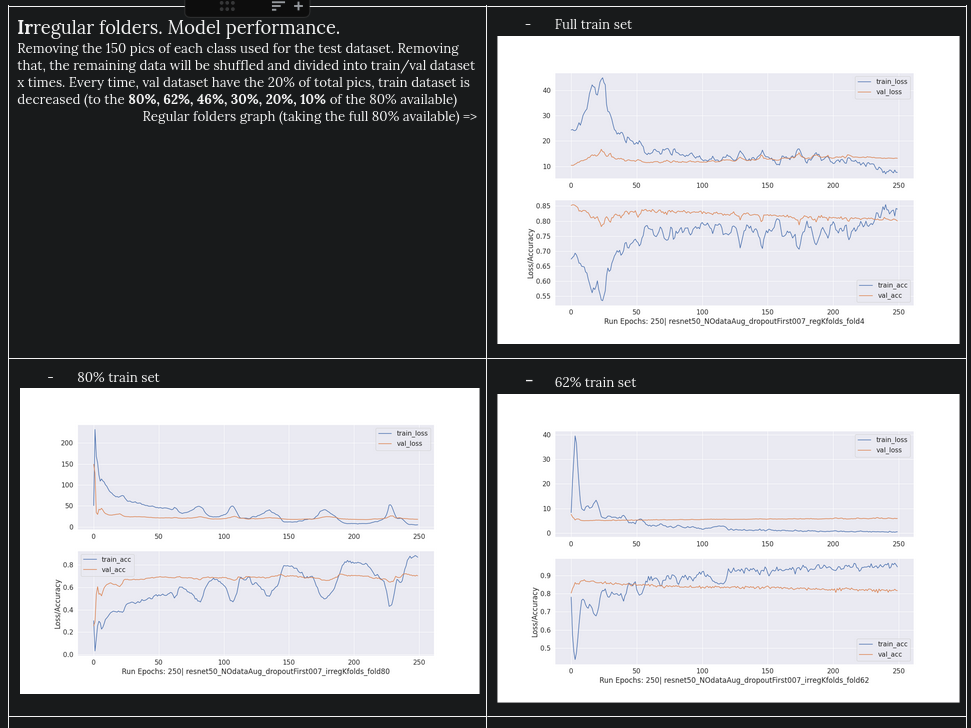
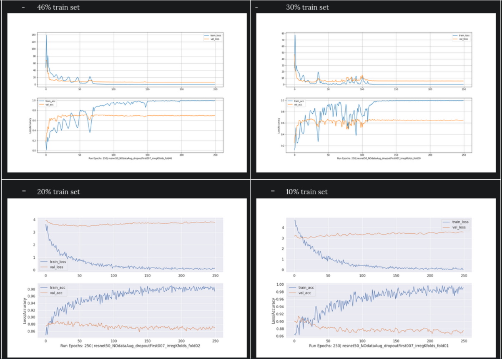

- Classification report: Over validation set (always changing) and test set (immutable):

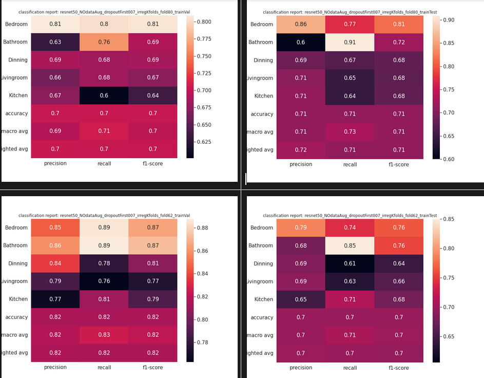
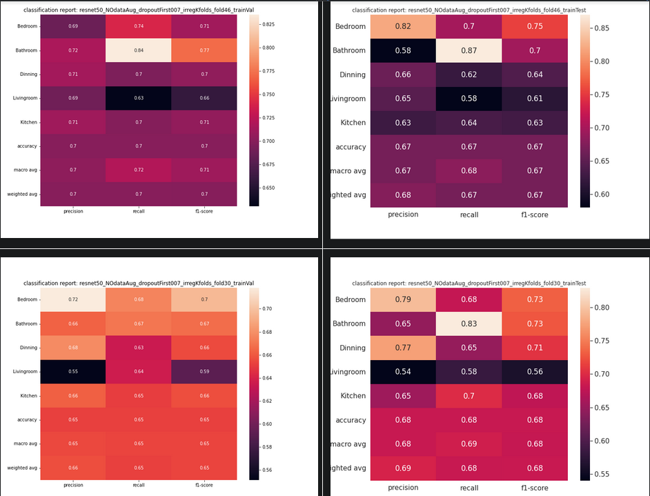
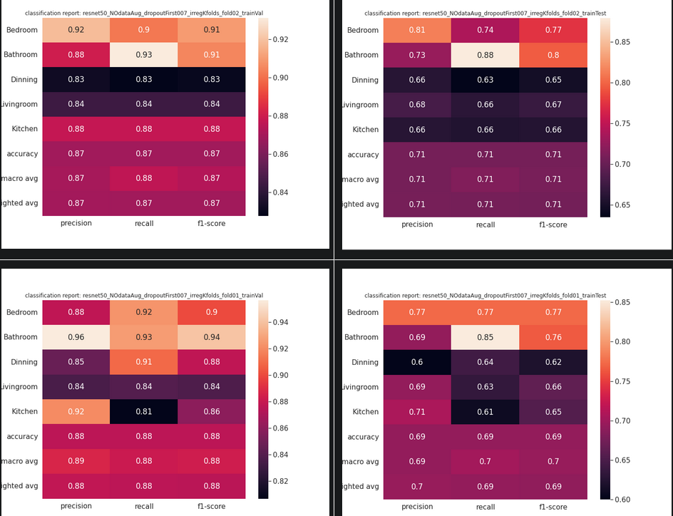

  
Confusion matrix: Over validation set (always changing) and test set (immutable):

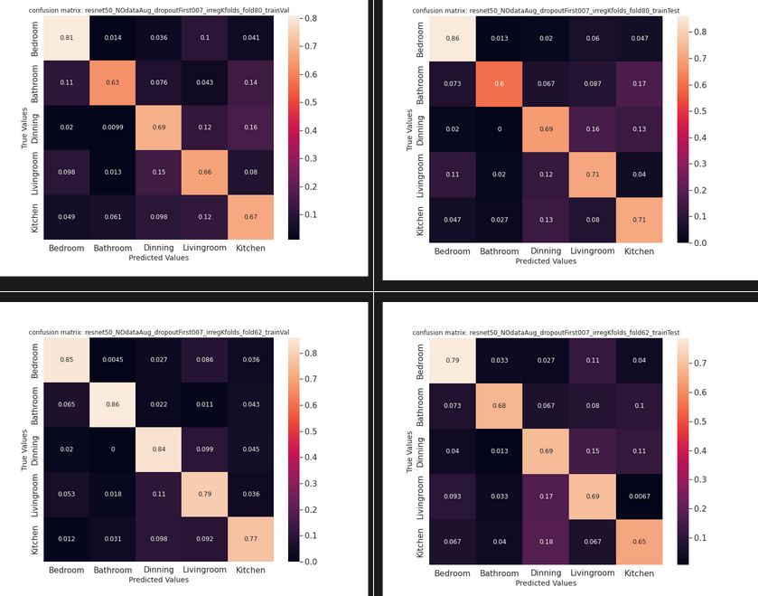
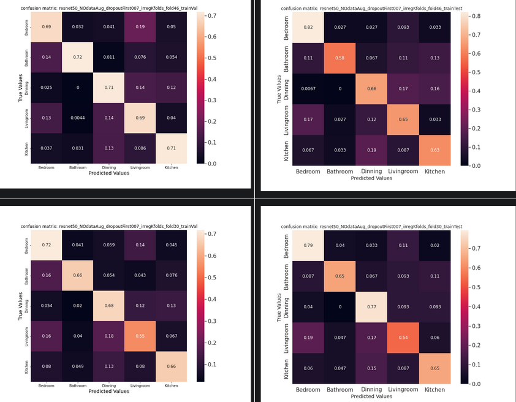

------------------------

----------------------------------

## 1. Methodology.

This is the study at the moment. It is evident that the initial volume is not optimal at all, and overfitting is going to be a hard nut to crack. So, in this circumstances, where the dataset can not be expanded, can we generate synthetic data to increase the global volume? Can we use it to balance the dataset, increasing the volume of classes with fewest pictures?

Before answering that, we have to discover:
- What are our pictures most easily misclassified (with equal probabilities for 2 or more classes).
- What are our pictures hardest to identify (with global lowest probabilities)

## 2. Development.

- Let's take the trained model for *regular folder1*, which has kind of a stable graph performance, and apply it to the whole data of *regular folder4*, whose data provokes a kind of weird performance graph.

- Then we'll run everythin to take the np.argmax ... oh, girlfriend came

## 3. Results.

## 4. Conclusions.

