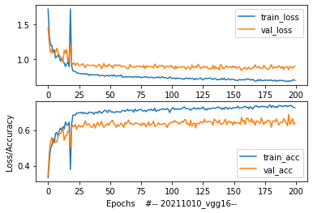
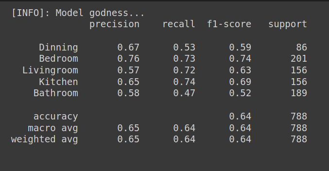

# Final Master's Work at VIU.
## Computer Vision classification for Real State.

----------------------------------


Hi there!

This repo is going to be quite messy while finding the best approach to the goals, which at the moment, look like this:
- Computer Vision to classify different spaces inside houses.
- Improve pre-trained models for that purpose.
- Study the viability of creating a Real State pricing problem, adding the previous results as features.

-------------------------
## Updates & evolution.

- https://docs.google.com/document/d/1z8G_THiNSHe14UcoJhIIcJL4NLlCuOiVTu6yvla37qo/edit


# Branches

- vgg19-analyticsindia
    - overfitting
    - too much layers
    - trained with too much classes

- vgg16

- resnet34 (if available)/resnet50 

-------------------------------------------
-------------------------------------------

- Tensorflow-GPU on Colab => https://colab.research.google.com/notebooks/gpu.ipynb#scrollTo=oM_8ELnJq_wd
- Why using GPU for Deep Learning => https://towardsdatascience.com/what-is-a-gpu-and-do-you-need-one-in-deep-learning-718b9597aa0d

------------------------------------

### Roadmap: 
<details>
  <summary>Click to expand</summary>

https://github.com/users/albertovpd/projects/8

----------------------------------
--------------------------------

- **meeting ___**

**vgg16**

- method
    - https://www.tensorflow.org/api_docs/python/tf/keras/applications/vgg16/VGG16
    - last layers of vgg16 are 2 dense layers of 4096 neurons and a last one of 1000 neurons (to classify 1000 different classes)
    - última capa dense cambiada de 4096 a 1000 (he visto que el top model eran 2 capas de 4096 y 1000, no 2 de 4k)
    - load all layers but the top model (last 3 dense layers). this will be the base model
    - freeze layers of base model (saving how they're trained)
    - we want to copy the vgg16 architecture, so we have to add manually the last layers: we'll add 2 dense layers of 4096 and change the last one designed to classifty 1000 classes for a 5-neurons layer.

    - early stopping descartado de momento, 
    me para el proceso a los 28 epochs, no sé cómo tunear eso, lo he llegado a poner hasta que pare a las 10epochs pero nada

- modifications
    - changed data augmentation, añadido randomness con vertical flip y shear range
    
    ```
    #Data Augmentation first
    train_generator = ImageDataGenerator(rotation_range=2, shear_range=0.2, vertical_flip=True, horizontal_flip=True, zoom_range=.1)
    val_generator = ImageDataGenerator(rotation_range=2, shear_range=0.2, vertical_flip=True, horizontal_flip=True, zoom_range=.1)
    test_generator = ImageDataGenerator(rotation_range=2, shear_range=0.2, vertical_flip=True, horizontal_flip= True, zoom_range=.1)
    ``` 
    - Mejora significativa en la performance (creo) aunque sigue habiendo overfitting fuerte. Entiendo que la clave es la librería de data augmentation que hablamos en su día
    
        
    - Sin duda alguna, las clase que tiene mejores métricas son los dormitorios, después cocina y salón. La que peor, cuarto de baño, que se corresponde el mayor número de imágenes
    ```
    Counter({'Livingroom': 1273, 'Bedroom': 1248, 'Dinning': 1158, 'Kitchen': 965, 'Bathroom': 606})
    ```

    - Si le meto dropout entre capa densa y capa densa, no sabría qué valor asignarle... 0.3? 0.2?? alguna manera de definir eso?

-----------------------------------------
-------------------------------------------


- **meeting 21.10.21**

- no podía establecer el modelo como sequential siguiendo los pasos del a vgg16, y hay gente que tiene problemas https://github.com/keras-team/keras/issues/9721 , pero he encontrado otra manera, y quiero comprobar que estoy haciéndolo de forma correcta

-vgg16: congelar las capas convolucionales.
    - cargar el modelo
    - añadir early stop
    ping como callback 
    - dejar termianr el entrenamiento
    - matriz de confusión: dependiendo de los resultados, si hay alguna clase que funciona muy mal, eliminar esa clase que funciona mal.
    - añadir dropout entre capa densa y capa densa del modelo
    - dejar el learning rate como lo tenía y comparar con lo nuevo. cambiando el learning rate y scheduler
    - más de un 5% de diferencia entre acc y val_acc ya es overfitting

- resnet
    - añadirle algo parecido a las dense como la vgg16 (2 de mil, 1 de mil y 2 de 5... ir buscando)
    - busca la arquitectura, mira las últimas capas que no estás cargando (include top = false, y mete capas)

    - añadir dropout entre capa densa y capa densa del modelo
- **PYIMAGESEARCH DATA AUGMENTATION**

- busca la clase model para crear arquitecturas si tienes problemas, como en la resnet50

- pyimage research para hacer pruebas y mejorar

------------------------------

- **meeting 27.09.21**

SIN DATA AUGMENTATION:

- elegir otra arquitectura de red

    - coger vgg16

    - entrenar con la vgg16 y cambiar la ÚLTIMA CAPA, aque en vez de 1000 neuronas, quitársela y ponerle 5 neuronas

- Una vez hecho esto, intentar usar un modelo un poco mejor

    - resnet que no tenga muchas capas (resnet34 quizás). cambiando la últia capa, poniendo 5 clases. debería funcionar mejor

- Si voy sobrado de tiempo: Una vez hecho esto, entrenar un autoencoder para que te reconstruya las imágenes, y usaremos su output como entrada, en vez de las imágenes del dataset en sí. (docu de tensorflow)


- Realizar los mismos procedimientos con data augmentation, probar este bloque => https://imgaug.readthedocs.io/en/latest/source/examples_basics.html#a-simple-and-common-augmentation-sequence

qué debe  involucrar data autmentation: (la librería de arriba ya te lo hace todo)

     - girar las imágenes de forma aleatoria, y aparte que cambie su color, DE FORMA ALEATORIA.

    - rotar / espejar / añadir ruido / cambiar contraste / cambiar brillo (color glitter) , y que se usen de forma aleatoria sobre mis datos de entrada.

    - img aug es muy buena a eso, ya incorpora estas incertidumbres.


- Para el futuro:

        - probar squeezenet

        - probar efficientnet (si es para clasificación


PLAZOS: 2 meses y medio.

- los 2 primeros puntos en 2 semanas.


-----------------

- Starting from here => https://www.kaggle.com/robinreni/house-rooms-image-dataset
- Inspect dataset
- Basic NN start:
    - Alexnet
    - ResNet
    - SqueezeNet
    - EfficientNet
    - any other I think it could be great
- Monk testing

</details>

-------------------------

Developer stuff:
<details>
  <summary>Click to expand</summary>

- https://github.com/users/albertovpd/projects/8
- https://github.com/albertovpd/viu-fundamentos_redes_neuronales/tree/main/colabs/tasks
- https://github.com/albertovpd/viu-fundamentos_redes_neuronales/blob/main/colabs/clase_2y3-Introduccion_a_Deep_Learning_Colab_ipynb.ipynb

- https://analyticsindiamag.com/transfer-learning-for-multi-class-image-classification-using-deep-convolutional-neural-network/
- https://machinelearningmastery.com/learning-curves-for-diagnosing-machine-learning-model-performance/
- https://towardsdatascience.com/handling-overfitting-in-deep-learning-models-c760ee047c6e
- https://www.kaggle.com/ryanholbrook/overfitting-and-underfitting

</details>


-----------------------------------------------

Stuff to check:
<details>
  <summary>Click to expand</summary>

De momento puedes ir echándole un ojo a estos enlaces. Si alguno no puedes porque es de pago, puedes usar sci-hub:


    - https://towardsdatascience.com/fast-real-estate-image-classification-using-machine-learning-with-code-32e0539eab96
    - https://www.researchgate.net/publication/316494092_Real_Estate_Image_Classification
    - https://restb.ai
    - https://vize.ai/real-estate
    - https://www.spiedigitallibrary.org/conference-proceedings-of-spie/11069/110691I/Classification-of-real-estate-images-using-transfer-learning/10.1117/12.2524417.short?SSO=1
    - https://www.trulia.com/blog/tech/image-recognition/
    - https://datafiniti.co/products/property-data/?gclid=Cj0KCQjwjPaCBhDkARIsAISZN7QOjbchXQJ_mQ37hpHtyPSpK-AV7S-LpZ-BxvjY2ic4vr3oxRlacWkaAjSXEALw_wcB
    - https://ieeexplore.ieee.org/abstract/document/7926631
    
</details>

------------------------------------------------

### Pending sources at this time:
<details>
  <summary>Click to expand</summary>

- Dataset: House price prediction with exterior front of houses (socal)
    - front (pics)
    - street
    - city
    - number
    - number of bedrooms
    - nomber of bathrooms
    - square feet
    - price
    - https://github.com/ted2020/House-Price-Prediction-via-Computer-Vision (no sé cómo usarlo)
    - kaggle dataset => https://www.kaggle.com/ted8080/house-prices-and-images-socal

- Dataset: House price prediction with 4 different rooms:
    - bathroom  (pics)
    - bedroom    (pics)
    - kitchen    (pics)
    - front of the house     (pics)
    - number of bedrooms
    - number of badooms
    - area
    - zipcode
    - price
    - https://github.com/emanhamed/Houses-dataset (paper incl)

- Dataset: House room dataset (5 different rooms)
    - bathroom
    - bedroom
    - dinning room
    - kitchen
    - living room
    - https://www.kaggle.com/robinreni/house-rooms-image-dataset


- RoomNet CNN. A Convolutional Neural Net to classify pictures of different rooms of a house/apartment (i don't know how to use it). Trained to classify 6 classes:
    - backyard
    - bathroom
    - bedroom
    - frontyard
    - kitchen
    - livingRoom
    - https://towardsdatascience.com/fast-real-estate-image-classification-using-machine-learning-with-code-32e0539eab96
    - 

- EXAMPLE: Monk library for house room type classification (7 classes)
    - Exterior 
    - bedroom
    - kitchen
    - living_room
    - Interior
    - bathroom
    - dining_room
    - https://towardsdatascience.com/image-classifier-house-room-type-classification-using-monk-library-d633795a42ef
    - https://github.com/Tessellate-Imaging/monk_v1/blob/master/study_roadmaps/4_image_classification_zoo/Classifier%20-%20House%20room%20type%20Claasification.ipynb

- categorizing listing airbnb photos (vigulgativo, no tiene dataset)
    -  Bedrooms
    - Bathrooms
    - Living Rooms
    - Kitchens
    - Swimming Pools
    - Views.
    - https://medium.com/airbnb-engineering/categorizing-listing-photos-at-airbnb-f9483f3ab7e3

</details>


-----------------------------------

#### Notes.
<details>
  <summary>Click to expand.</summary>
TFM: Línea Temática: Sistema automático de clasificación de viviendas mediante el uso únicamente de fotografías


# Notes

- RoomNet
    - forkeada
    - 6 clasificaciones: Backyard-0, Bathroom-1, Bedroom-2, Frontyard-3, Kitchen-4, LivingRoom-5
- Redes neuronales convolucionales / versiones, como la vgg-19
- long short term memory (LSTM), and fully connected neural networks

- Preprocesado: 'contrast-limited adaptive histogram equalization (CLAHE) for image enhancement
- AHE: es una manera de mejorar el contraste en imágenes, con una superposición de histogramas, cada uno correspondiendo a partes diferentes de la imagen. Mejora los bordes y la definición, pero puede meter mucho ruido en zonas homogéneas de la imagen, y CLAHE lo qu ehace es optimizar esto.

- https://towardsdatascience.com/fast-real-estate-image-classification-using-machine-learning-with-code-32e0539eab96

- https://www.researchgate.net/publication/316494092_Real_Estate_Image_Classification

- https://restb.ai/
    - no veo que haya una api disponible para uso personal gratuito

- https://vize.ai/real-estate
    - no veo que haya una api disponible para uso personal

- https://www.spiedigitallibrary.org/conference-proceedings-of-spie/11069/110691I/Classification-of-real-estate-images-using-transfer-learning/10.1117/12.2524417.short?SSO=1 
    - de pago

- https://www.trulia.com/blog/tech/image-recognition/#
    - entiendo que esta web es para coger ideas

- https://datafiniti.co/products/property-data/?gclid=Cj0KCQjwjPaCBhDkARIsAISZN7QOjbchXQJ_mQ37hpHtyPSpK-AV7S-LpZ-BxvjY2ic4vr3oxRlacWkaAjSXEALw_wcB
    - lo mismo pero tiene ubicación en google maps

- https://ieeexplore.ieee.org/abstract/document/7926631
    - de pago

# PASOS:

- descargar datasets públicos
    - con imágenes
    - buscar dataset con precio, e imágenes, 500-600 imágenes

- usar la roomNet para clasificar automáticamente las imágenes... o no

-  keras
    -  https://customers.pyimagesearch.com/lesson-sample-training-your-first-cnn/
    - https://www.pyimagesearch.com/2018/04/16/keras-and-convolutional-neural-networks-cnns/


</details>

---------------

**Personal info**
<details>
  <summary>Click to expand.</summary>

https://www.linkedin.com/in/alberto-vargas-pina/


</details>
