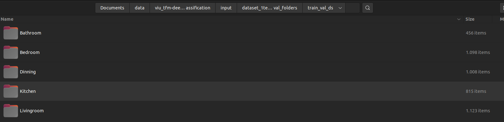
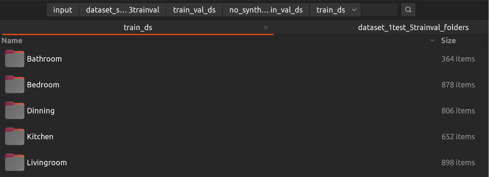
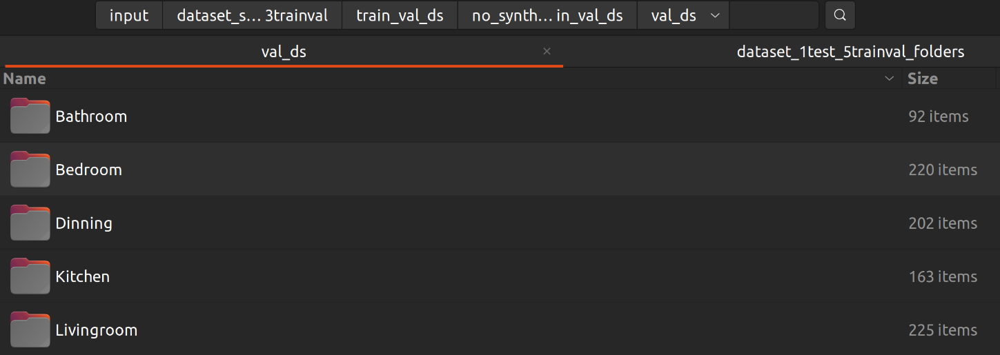

# Final Master's Work at VIU.

The dataset was shuffled. Then 150 pics of each class were stored as test_set.

The remaining ones were shuffled again, and split into train (80%) and validation (20%)

- Without fake pics, the volume available of pictures to share between train/val sets we have:

After splitting it:
- train:

- validation:

Now none, 50, 250 and 480 synthetic pictures will be added to each class within the train set. 

Model performance will be compared: Without fake data, with 50, 250 and 480 fake pics.

Also, fake data will be also added just to the classes with lower volume, in an attempt to balance the dataset. 
Model performance will be tested as well.
